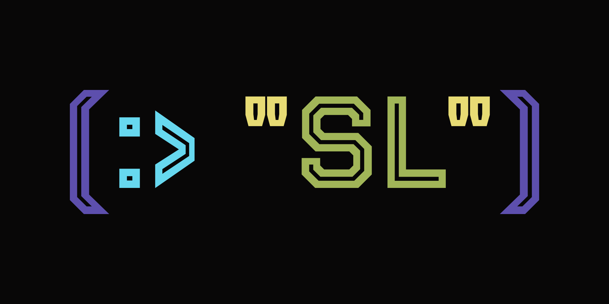

<h1 align="center">The SL Programing Language</h1>

	<a href="https://github.com/sl-lang/sll"> </a>
	<i>SLL is a simple yet powerful programing language intended for beginner as well as advanced software developers.</i>

Currently now documentation has been written (PRs welcome!). The <a href="CHANGELOG.md">Change Log</a> is a temporary documentation.
